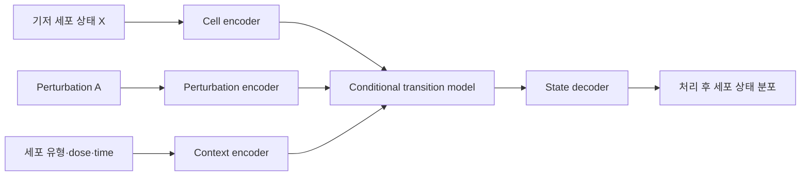

# Virtual Cell 모델 설계 청사진

## 1. 문서의 목적

이 문서는 Virtual Cell 모델을 설계하기 위한 개념적·기술적 청사진이다. 특정 아키텍처를 먼저 선택하기보다 다음 질문에 순서대로 답하는 것을 목표로 한다.

1. Virtual Cell은 궁극적으로 무엇을 해야 하는가?
2. 어떤 생물학적 세계를 어느 수준까지 모델링할 것인가?
3. 어떤 데이터와 인과적 가정이 필요한가?
4. 모델의 입력·출력과 일반화 목표는 무엇인가?
5. 어떤 기준으로 모델이 실제 실험에 유용한지 평가할 것인가?
6. 어떻게 예측 모델에서 역설계 및 폐쇄형 실험 시스템으로 발전시킬 것인가?

---

## 2. Virtual Cell의 근본적인 목표

Virtual Cell은 단순한 single-cell foundation model이나 세포 생성 모델이 아니다. 핵심 목적은 **특정 맥락의 세포에 개입을 가했을 때 나타날 결과를 실험 전에 예측하는 세포 수준의 causal world model**을 구축하는 것이다.

이를 다음 조건부 분포로 표현할 수 있다.

$$
p(X_{t+\Delta t}\mid X_t, A, C)
$$

- $X_t$: 개입 전 세포 상태
- $A$: 유전자, 약물 또는 환경적 perturbation
- $C$: 세포 유형, 환자, 조직, 농도, 시간 등 생물학적 맥락
- $X_{t+\Delta t}$: 개입 후 세포 상태

출력은 하나의 결정론적 벡터보다 **세포 집단의 확률분포**로 표현하는 것이 바람직하다. 같은 개입을 받은 세포들도 서로 다르게 반응할 수 있기 때문이다.

궁극적인 Virtual Cell은 정방향 예측뿐 아니라 역문제도 풀어야 한다.

$$
A^*=\arg\max_A \operatorname{Utility}\left[p(X_{t+\Delta t}\mid X_t,A,C)\right]
$$

즉, 궁극적인 질문은 다음과 같다.

> 원하는 세포 상태를 만들기 위한 최적의 개입은 무엇인가?

Virtual Cell의 가치는 그럴듯한 세포 데이터를 생성하는 능력이 아니라, **아직 수행하지 않은 실험의 결과를 정확하고 의사결정에 유용하게 예측하는 능력**으로 평가해야 한다.

---

## 3. Virtual Cell의 성숙 단계

### 3.1 세포 상태 표현

RNA, 단백질, chromatin accessibility, 대사체, 형태 등의 측정값을 이용하여 세포 상태를 표현한다.

```text
RNA + protein + chromatin + morphology
                ↓
        cell-state representation
```

이 단계만 수행하는 모델은 cell foundation model일 수 있지만, 아직 개입의 결과를 모사하는 Virtual Cell이라고 하기는 어렵다.

### 3.2 정방향 perturbation 예측

현재 상태와 개입이 주어졌을 때 처리 후 상태를 예측한다.

```text
현재 세포 상태 + KRAS 억제
→ 예상 transcriptome 및 phenotype
```

현재 Virtual Cell 연구의 중심 과제다.

### 3.3 기전적 설명

모델은 결과뿐 아니라 가능한 생물학적 경로도 제시할 수 있어야 한다.

```text
KRAS 억제
→ MAPK 신호 감소
→ MYC target 감소
→ cell-cycle arrest
```

이를 위해 gene regulatory network, pathway, protein interaction 및 signaling cascade와 예측을 연결할 필요가 있다.

### 3.4 역설계

목표 상태를 먼저 지정하고 그 상태를 만들 개입을 탐색한다.

```text
질병 상태 → 정상에 가까운 상태
어떤 유전자·약물·조합이 필요한가?
```

### 3.5 폐쇄형 발견 시스템

모델이 후보 실험을 선택하고, 실험 결과로 다시 학습하는 순환 구조를 만든다.


---

## 4. 문제 범위 정의

처음부터 모든 인간 세포와 모든 개입을 포괄하려 해서는 안 된다. 아래의 각 설계축을 명시적으로 정의해야 한다.

| 설계축 | 가능한 선택 |
|---|---|
| 생물학적 맥락 | 특정 암세포주, PBMC, 줄기세포, organoid |
| 개입 종류 | CRISPRi, knockout, overexpression, 약물, cytokine |
| 출력 modality | RNA, RNA+protein, ATAC, morphology, viability |
| 시간 범위 | 단일 endpoint 또는 time series |
| 농도 | 단일 농도 또는 dose response |
| 예측 단위 | pseudobulk, 세포 단위 또는 세포 집단 분포 |
| 일반화 축 | 새로운 유전자, 약물, 세포 유형, 환자, 조합 |
| 활용 목적 | 반응 예측, 표적 탐색, 약물 순위화, 기전 발견 |

좋은 초기 연구 질문의 예시는 다음과 같다.

> 여러 암세포주에서 관찰한 perturbation 효과를 학습하여, 새로운 암세포주에서 처음 보는 유전자 억제의 24시간 후 transcriptome 분포를 예측한다.

모델의 정체성은 아키텍처보다 **어떤 축에서 일반화하도록 설계했는가**에 의해 결정된다.

---

## 5. 데이터 설계

### 5.1 관찰 데이터와 개입 데이터

관찰형 single-cell 데이터는 세포 상태를 학습하는 데 유용하지만, 인과적 perturbation 효과를 직접 제공하지 않는다.

```text
유전자 A가 높다 ↔ 세포 증식이 빠르다
```

이 상관관계만으로는 A를 억제했을 때 증식이 감소한다고 결론 내릴 수 없다. 따라서 CRISPR, 약물, cytokine 처리와 같은 **interventional data**가 핵심이다.

### 5.2 필수 데이터와 메타데이터

- untreated 및 non-targeting control
- perturbation ID, 종류 및 강도
- 세포 유형, 세포주, donor 및 유전적 배경
- 약물 농도와 처리 시간
- biological replicate와 technical batch
- raw count와 품질관리 정보
- perturbation efficiency 및 off-target 정보
- 가능하면 단백질, ATAC, morphology, viability 등의 보조 readout

### 5.3 세포 전후 상태의 비대응성

일반적인 single-cell sequencing은 세포를 파괴하므로 동일한 세포의 처리 전후 상태를 직접 관찰할 수 없다.

```text
관찰 불가능한 이상적 자료:
처리 전 세포 A → 처리 후 동일한 세포 A

실제 자료:
control 세포 집단 분포 → perturbed 세포 집단 분포
```

따라서 이 문제는 단순한 세포별 회귀가 아니라 **한 집단 분포에서 다른 집단 분포로의 조건부 transport**로 보는 것이 자연스럽다.

초기 MVP에서는 pseudobulk 평균을 예측할 수 있지만, 평균만으로는 responder, non-responder 및 resistant subpopulation을 재현할 수 없다.

### 5.4 데이터 분할 원칙

세포를 무작위로 나누면 동일 perturbation이나 batch가 train과 test에 섞여 성능이 과대평가될 수 있다. 다음 축을 기준으로 명시적인 held-out 평가를 구성해야 한다.

- unseen perturbation
- unseen cell type 또는 cell line
- unseen donor
- unseen perturbation combination
- unseen dose 또는 timepoint
- unseen laboratory 또는 batch
- in vitro에서 in vivo로의 일반화

---

## 6. 권장 모델 구조



### 6.1 Cell encoder

개입 전 세포 상태를 표현한다.

- PCA 또는 factor model
- autoencoder 또는 VAE
- transformer
- pathway activity representation

대형 transformer를 기본값으로 가정하지 않는다. 데이터 규모와 일반화 과제에 따라 PCA, low-rank model 또는 VAE가 더 강한 출발점일 수 있다.

### 6.2 Perturbation encoder

개입의 생물학적 특성을 표현한다.

- 유전자: gene embedding, pathway, interaction network, sequence
- 약물: molecular graph, SMILES encoder, target profile
- 조합: set encoder 또는 interaction model
- 농도와 시간: continuous embedding

유전자를 임의의 ID로만 표현하면 학습하지 않은 유전자에 대한 zero-shot 일반화가 어렵다. 기능, 서열, pathway 및 네트워크 정보를 활용해야 한다.

### 6.3 Context encoder

반응을 바꾸는 맥락을 표현한다.

- cell type 또는 cell line
- donor 및 genotype
- tissue 및 disease state
- culture condition
- dose와 timepoint
- 실험 batch

Batch는 생물학적 맥락과 구분하여 모델링해야 한다.

### 6.4 Conditional transition model

개입이 세포 상태를 어떻게 이동시키는지 학습한다.

- 선형 및 low-rank regression
- conditional VAE
- optimal transport
- transformer
- graph neural network
- neural ODE 또는 SDE
- diffusion 또는 flow model

단일 endpoint 데이터만 있다면 neural ODE를 사용하더라도 실제 시간 dynamics를 식별했다고 주장하기 어렵다. 시간적 기전을 모델링하려면 여러 timepoint 또는 lineage 정보가 필요하다.

### 6.5 State decoder

목표에 따라 다음을 출력한다.

- 평균 발현 또는 pseudobulk
- 개별 세포의 조건부 분포
- differential expression
- cell-state proportion
- viability 및 phenotype
- 예측 불확실성

---

## 7. Baseline 설계

복잡한 모델은 반드시 단순한 대안과 비교해야 한다.

1. **No-change baseline:** control과 같다고 예측
2. **Perturbation-mean baseline:** 다른 맥락에서 관찰한 평균 효과 사용
3. **Additive linear model**
4. **Nearest-neighbor perturbation model**
5. **PCA 또는 low-rank regression**
6. 제안하는 deep-learning model

Deep-learning perturbation 모델이 단순 선형 모델을 일관되게 능가하지 못한다는 벤치마크 결과도 존재한다. 복잡한 모델이 baseline을 이기지 못한다면 모델 크기보다 데이터 누출, 신호 크기, 분할 방식 및 문제 정의를 먼저 점검해야 한다.

---

## 8. 평가 체계

### 8.1 기본 transcriptome 평가

- **DES, Differential Expression Score:** 차등 발현 유전자를 올바르게 찾는가?
- **PDS, Perturbation Discrimination Score:** 서로 다른 perturbation 효과를 구별하는가?
- **MAE 또는 RMSE:** 전체 발현값을 얼마나 정확히 예측하는가?
- Pearson 또는 Spearman correlation
- up/down direction accuracy

단일 지표만 사용해서는 안 된다. 예를 들어 모든 perturbation에 control 평균을 출력하는 모델은 전체 오차가 낮을 수 있지만 실제 perturbation 효과를 구별하지 못할 수 있다.

### 8.2 분포 수준 평가

- Wasserstein distance
- Maximum Mean Discrepancy, MMD
- 에너지 거리
- 세포 아형별 비율과 상태 변화
- responder와 resistant population 재현

### 8.3 생물학적 평가

- pathway activity recovery
- gene regulatory network consistency
- known target 및 mechanism recovery
- viability, differentiation, drug response 예측
- 정상세포와 질병세포 사이의 선택성

### 8.4 불확실성 평가

- uncertainty calibration
- prediction interval coverage
- out-of-distribution 탐지
- 반복 실험 간 변동성과 예측 분산의 일치

### 8.5 의사결정 수준 평가

가장 중요한 최종 평가는 모델이 선택한 후보를 실제로 실험하는 것이다.

> 모델이 선택한 perturbation 후보가 기존 선별 방법보다 높은 실험적 hit rate를 보이는가?

---

## 9. 인과성 및 불확실성

### 9.1 인과성

Perturbation 데이터라고 해서 모든 예측이 자동으로 인과적인 것은 아니다. 다음 요소를 통제해야 한다.

- perturbation 배정 방식
- 적절한 대조군
- batch와 처리 시점
- guide 효율과 off-target
- 세포 생존에 따른 selection bias
- replicate 및 donor 구조

모델이 추정하려는 causal estimand도 명확해야 한다. 예를 들어 평균 처리 효과, 세포 상태별 조건부 효과, 특정 subpopulation에 대한 효과는 서로 다른 문제다.

### 9.2 불확실성

모델은 최소한 다음 두 종류를 구분해야 한다.

- **Aleatoric uncertainty:** 세포 집단 자체의 확률적 이질성
- **Epistemic uncertainty:** 훈련 데이터와 모델 지식의 부족

훈련에 없던 세포 유형이나 약물에 대한 예측에는 높은 epistemic uncertainty가 표시되어야 한다. Virtual Cell은 예측뿐 아니라 **어떤 조건에서 실제 실험이 반드시 필요한지** 알려야 한다.

---

## 10. 역설계

정방향 모델이 충분히 검증된 후 원하는 상태를 만드는 perturbation을 탐색한다.

목적함수에는 단순한 질병 상태 개선뿐 아니라 여러 제약을 포함해야 한다.

$$
\operatorname{Score}(A)=
\operatorname{Efficacy}(A)
-\lambda_1\operatorname{Toxicity}(A)
-\lambda_2\operatorname{OffTarget}(A)
-\lambda_3\operatorname{Uncertainty}(A)
$$

고려할 요소는 다음과 같다.

- 목표 세포에서의 효능
- 정상세포에서의 독성
- off-target 효과
- perturbation 조합의 상호작용
- 실험 및 치료 가능성
- 모델의 예측 불확실성

역설계 결과는 치료법 자체가 아니라 **실험 우선순위가 높은 가설**로 다루어야 한다.

---

## 11. Lab-in-the-loop 및 능동학습

모든 perturbation을 실험할 수 없으므로 다음 실험을 전략적으로 선택한다.

선택 기준의 예시는 다음과 같다.

- 예측 불확실성이 높은 후보
- 후보 간 모델의 의견 불일치가 큰 영역
- 새로운 pathway 또는 세포 맥락을 대표하는 후보
- 높은 치료 효용이 예상되는 후보
- 모델이 아직 보지 못한 조합

이 과정은 단순한 정확도 향상이 아니라 최소 실험 수로 최대의 생물학적 정보를 획득하는 것을 목표로 한다.

---

## 12. 단계별 개발 로드맵

### Phase 0 — 목적 정의

- 생물학적 시스템 하나 선택
- intervention, readout 및 timepoint 고정
- 일반화 축 하나 선택
- 모델이 대체하거나 선별할 실제 실험 정의

### Phase 1 — 데이터와 benchmark

- control 및 perturbation 데이터 정리
- metadata, batch 및 replicate 검증
- 데이터 누출 없는 split 구성
- 단순 baseline 구축

### Phase 2 — 최소 정방향 모델

$$
(\text{baseline state},\text{perturbation},\text{context})
\rightarrow \text{pseudobulk response}
$$

우선 differential expression과 반응 방향을 안정적으로 예측하는지 확인한다.

### Phase 3 — 세포 집단 모델

평균 벡터를 넘어 heterogeneous cell population을 생성하고 다음을 재현한다.

- subpopulation proportion
- responder와 non-responder
- state transition의 확률적 다양성

### Phase 4 — Multimodal 및 temporal 확장

RNA 외에 다음 modality를 결합한다.

- protein
- chromatin accessibility
- morphology
- viability
- spatial context
- 여러 timepoint

### Phase 5 — 역설계

원하는 상태를 유도할 perturbation과 조합을 탐색한다. 효능, 안전성, 선택성 및 불확실성을 동시에 최적화한다.

### Phase 6 — 폐쇄형 실험 검증

모델이 다음 실험을 제안하고, 독립 실험 결과를 이용해 모델을 업데이트한다.

---

## 13. 권장 첫 번째 MVP

### 연구 질문

> 한 종류의 perturbation과 하나의 endpoint를 사용해, 새로운 세포 맥락에서 perturbation 후 transcriptome과 세포 집단 분포를 예측한다.

### 권장 사양

- **입력:** control scRNA-seq, perturbation gene, cell line 또는 cell type
- **출력:** 24시간 후 transcriptome 분포
- **데이터 분할:** held-out cell line × held-out perturbation
- **baseline:** additive linear model 및 perturbation mean
- **모델:** cell/context encoder + gene encoder + conditional transport model
- **평가:** DE 방향성, DES, PDS, MAE, 분포 거리, pathway recovery
- **최종 검증:** 예측한 상위 perturbation을 독립 실험으로 검증

### 성공 기준

1. 단순 baseline을 여러 지표에서 안정적으로 능가한다.
2. 훈련에서 제외한 biological context에서도 성능이 유지된다.
3. 평균뿐 아니라 반응의 이질성을 재현한다.
4. 예측 불확실성이 실제 오차와 보정되어 있다.
5. 모델이 선택한 실험 후보가 기존 방법보다 높은 hit rate를 보인다.

---

## 14. 장기적 확장 방향

장기적인 Virtual Cell은 다음 계층을 연결하는 다중 스케일 모델로 발전할 수 있다.

```text
DNA·variant
    ↓
gene regulation
    ↓
RNA·protein·metabolism
    ↓
cell state and phenotype
    ↓
cell–cell interaction
    ↓
tissue and disease outcome
```

이때 AI 단백질·항체·효소 설계와 Virtual Cell은 다음과 같이 연결된다.

```text
Virtual Cell이 치료 표적과 원하는 작용 방식 탐색
                    ↓
단백질 모델이 항체·효소·치료 단백질 설계
                    ↓
Virtual Cell이 세포 수준 효능·독성·우회 반응 예측
                    ↓
실험 검증 및 공동 재학습
```

단백질 설계 모델이 **무엇을 만들 것인가**를 해결한다면, Virtual Cell은 **그 분자가 세포를 어떻게 바꿀 것인가**를 해결한다.

---

## 15. 핵심 설계 원칙

1. 아키텍처보다 생물학적 질문과 일반화 목표를 먼저 정의한다.
2. Virtual Cell을 단일 세포 벡터 예측이 아닌 조건부 분포 전이 문제로 본다.
3. 관찰 데이터와 개입 데이터를 구분한다.
4. 복잡한 모델은 반드시 강한 단순 baseline과 비교한다.
5. 랜덤 cell split 대신 실제 활용 상황을 반영한 held-out context 평가를 사용한다.
6. 평균 오차뿐 아니라 differential expression, 분포, pathway 및 phenotype을 평가한다.
7. 정방향 예측이 검증되기 전에 역설계를 서두르지 않는다.
8. 불확실성과 적용 범위를 명시적으로 출력한다.
9. 최종 평가는 새로운 실험에서의 hit rate로 수행한다.
10. 장기적으로는 능동학습을 이용한 closed-loop discovery system을 지향한다.

---

## 16. 참고 자료

- [Arc Institute: Virtual Cell Challenge 2025](https://arcinstitute.org/news/virtual-cell-challenge-2025)
- [Arc Institute: Behind the Data of the Virtual Cell Challenge](https://arcinstitute.org/news/behind-the-data-virtual-cell-challenge)
- [Arc Institute: STATE Virtual Cell Model](https://arcinstitute.org/news/virtual-cell-model-state)
- [Nature Reviews Genetics: Interpretation, extrapolation and perturbation of single cells](https://www.nature.com/articles/s41576-025-00920-4.pdf)
- [Nature Methods: Deep-learning-based gene perturbation effect prediction does not yet outperform simple linear baselines](https://www.nature.com/articles/s41592-025-02772-6.pdf)

